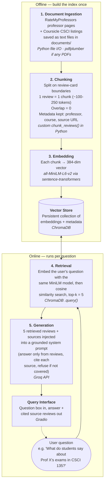

# Project 1 Planning: The Unofficial Guide

> Write this document before you write any pipeline code.
> Your spec and architecture diagram are what you'll use to direct AI tools (Claude, Copilot, etc.) to generate your implementation — the more specific they are, the more useful the generated code will be.
> Update the Retrieval Approach and Chunking Strategy sections if you change your approach during implementation.
> Update this file before starting any stretch features.

---

## Domain

<!-- What domain did you choose? Why is this knowledge valuable and hard to find through official channels? --> Howard University CS Professor & Course Reviews, This knowledge is valuable and hard to find because real opinions and ratings on professors isnt easy to find unless you speak to specific students and even then its difficult because sometimes their answer may not be genuine so an annonymous place where by choice people can give real opinions as a student is valuable.

---

## Documents

<!-- List your specific sources: URLs, subreddit names, forum threads, or file descriptions.
     Aim for at least 10 sources that together cover different subtopics or perspectives within your domain. -->

| # | Source | Description | URL or location |
|---|--------|-------------|-----------------|
| 1 | | | | https://www.ratemyprofessors.com/search/professors/421?did=11&q=*&utm_source
| 2 | | | |https://www.ratemyprofessors.com/professor/2640220?utm_source
| 3 | | | |https://www.ratemyprofessors.com/professor/2976470?utm_source
| 4 | | | |https://www.ratemyprofessors.com/professor/2418869?utm_source
| 5 | | | |https://www.ratemyprofessors.com/professor/2672438?utm_source
| 6 | | | |https://www.ratemyprofessors.com/school/421?utm_source
| 7 | | | |ratemyprofessors.com/professor/2725790
| 8 | | | |ratemyprofessors.com/professor/2323879
| 9 | | | |ratemyprofessors.com/professor/2084505
| 10 | | | |coursicle.com/howard/courses/CSCI

---

## Chunking Strategy

<!-- How will you split documents into chunks?
     State your chunk size (in tokens or characters), overlap size, and explain why those
     numbers fit the structure of your documents.
     A review-heavy corpus warrants different chunking than a long FAQ. -->

**Chunk size:** One complete review card per chunk typically 100-250 tokens

**Overlap:** 0

**Reasoning:**- Itll be made up of short, review card reviews. Because RateMyProfessor already is made up of reviews in self-contained information. Keeping it in one chunk preserves the context of the students experience.

---

## Retrieval Approach

<!-- Which embedding model are you using (e.g., all-MiniLM-L6-v2 via sentence-transformers)?
     How many chunks will you retrieve per query (top-k)?
     If you were deploying this for real users and cost wasn't a constraint, what tradeoffs
     would you weigh in choosing a different embedding model — context length, multilingual
     support, accuracy on domain-specific text, latency? -->

**Embedding model:** I will use all-MiniLM-L6-v2 via sentence-transformers. This model is shown to be lightweight, fast and works well for semantic similarity, which for my project helps with student-reviews where users will typically phrase questions differently from the wording used in reviews.

**Top-k:** 5 Chunks per query. Retrieving 5 reviews should give the perspective needed to answer a question without my model dragging in unnecessary information.

**Production tradeoff reflection:** If this were to be for real users and cost were not an issue then I would consider a larger/ more advanced embedding model. I could compare different models based on accuracy, context length, performance on student/course specific language, maybe even multilingual support. A more powerful model could better understand questions that maybe werent formed as well english wise but closer to how a college student may speak. "Which professor is chill but still gives useful feedback? But for now , all-MiniLM-L6-v2 provides a good balance between accuracy, speed, and simplicity.

---

## Evaluation Plan

<!-- List your 5 test questions with their expected correct answers.
     Questions should be specific enough that you can judge whether the system's response
     is right or wrong. "What are good dining halls?" is too vague.
     "What do students say about wait times at [dining hall name] during lunch?" is testable. -->

| # | Question | Expected answer |
|---|----------|-----------------|
| 1 | | | What do students say about the difficulty of Professor X's exams?| Review should summarize whether students generlly describe professor X's exams as easy, medium or hard and potetially include any comments about preparation or exam material. 
| 2 | | |What do students say about the workload for CSCI 245 with Professor X? Students generally describe the workload as [manageable/heavy/etc.], with reviews mentioning the amount of homework, projects, or studying required.
| 3 | | |Which professors in the collected reviews are described as giving useful feedback on assignments or projects? The system should identify professors whose reviews specifically mention detailed, helpful, or constructive feedback and cite the reviews supporting those claims.
| 4 | | | What do students say about Professor X's teaching style in CSCI 135?The answer should summarize comments about Professor X's lectures, explanations, availability, and ability to communicate course concepts, rather than relying only on the professor's overall rating.
| 5 | | | Based on student reviews, how does Professor X compare with Professor Y for workload and exam difficulty? The system should compare the two professors using evidence from their respective reviews, identifying differences in workload and exam difficulty and citing the relevant sources.

---

## Anticipated Challenges

<!-- What could go wrong? Name at least two specific risks with reasoning.
     Consider: noisy or inconsistent documents, missing source attribution, off-topic
     retrieval, chunks that split key information across boundaries. -->

1. Because these sources are human filled they could lack info especially chunk to chunk

2. Id also worry for noisy documents, some comments could be untrue or biased or not on topic.

---

## Architecture

<!-- Draw a diagram of your pipeline showing the five stages:
     Document Ingestion → Chunking → Embedding + Vector Store → Retrieval → Generation
     Label each stage with the tool or library you're using.
     You can use ASCII art, a Mermaid diagram, or embed a sketch as an image.
     You'll use this diagram as context when prompting AI tools to implement each stage. -->

---

## AI Tool Plan

<!-- For each part of the pipeline below, describe:
     - Which AI tool you plan to use (Claude, Copilot, ChatGPT, etc.)
     - What you'll give it as input (which sections of this planning.md, which requirements)
     - What you expect it to produce
     - How you'll verify the output matches your spec
     "I'll use AI to help me code" is not a plan.
     "I'll give Claude my Chunking Strategy section and ask it to implement chunk_text()
     with my specified chunk size and overlap" is a plan. -->

**Milestone 3 — Ingestion and chunking:** Claude, id input my chunking strategy-metadata fields = professor name, course code, source URL, quality/difficulty/would-take-again scores where present)A chunk_text()   parse_source()` script that takes raw scraped HTML for either source type and returns a list of chunk objects. Run it against all 10 saved source pages, then manually spot-check 15–20 output chunks against the live page: confirm no chunk merges two different reviews

**Milestone 4 — Embedding and retrieval:** Claude, The chunk schema from Milestone 3's output, my choice of embedding model and vector store (e.g. Chroma/FAISS), and a short list of 5–8 example questions spanning my domain ("who's the easiest CSCI 135 professor," "which course has the worst workload") so retrieval logic is written against realistic queries, not guessed at.embed_chunks() to build the index, and retrieve(query, k) returning the top-k chunk objects with similarity scores.For each of the 5–8 test questions, manually determine which 1–2 source chunks should be the "right" answer, then check they actually appear in the top-k results. Also check similarity scores aren't degenerate (e.g. everything scoring near-identical), and that retrieval doesn't silently return chunks from the wrong professor/course when names are similar.

**Milestone 5 — Generation and interface:** Claude, The retrieval output schema, my citation requirement (every claim must cite the specific chunk/source URL it came from), and 2–3 example question→ideal-answer pairs showing the tone and citation format I want. A generate_answer(query, retrieved_chunks)Run the same 5–8 test questions end-to-end and check three things by hand: (1) every factual claim in the answer traces to a specific retrieved chunk, (2) citations point to real source URLs and not fabricated ones, (3) the system says "I don't know" or similar when retrieval returns nothing relevant, instead of hallucinating
